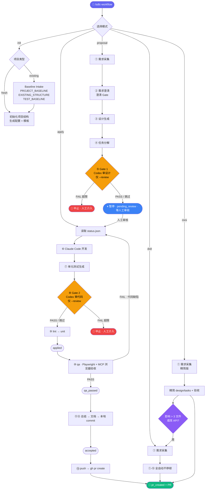

# 设计理念 · SDLC Workflow Suite

> **让 AI 按工程规矩干活，而不是自由发挥。**
>
> 一套面向 Claude Code / Codex 的全流程 SDLC 自动化技能——从需求拆解到 PR，中间有人工审核门、可选的设计/代码审查、浏览器功能验收，每一步都有产物、有证据、可恢复。

---

## 为什么需要它

你已经在用 Claude Code / Cursor / Codex 写代码了。但你大概率遇到过这些场面：

| 痛点 | 你现在怎么处理 | 用了这套系统之后 |
|------|--------------|----------------|
| 模型擅自把目录结构改了 | 事后人工修，或者放弃 | 目录约束作为规则注入，Gate 校验 |
| AI 设计方案没经过人审就直接写代码 | 写完才发现方向不对 | proposal 暂停等人工审核，apply 才开始开发 |
| 说"已完成"但实际没测 | 手动逐个验证 | qa 必须有浏览器交互证据与报告 |
| 老项目交给 AI 被当新项目重建 | 反复解释"别动现有架构" | 先 intake 再开发，baseline 锁定现有结构 |
| 审查全靠自己看 diff | 看不过来就跳过 | `--review` 时 Codex CLI 自动审查，Gate 失败就停 |
| commit / PR 一把梭，难回退 | 出错只能 reset | accept 只本地 commit，确认后 pr 才推送 |
| 做了什么改动过两天就忘 | 翻 Git log 猜 | 每轮需求生成独立 iteration 目录 |
| 多需求 / 多 Agent 想并行 | 共用工作目录互相踩 | worktree：git worktree 隔离 + 自动端口 + 注册表 |

**一句话总结**：用**工程 contract** 而非 prompt 技巧来约束 AI 行为的 SDLC 系统。

---

## 30 秒理解它做了什么

```
你说一个需求
  ↓
proposal：requirements → design → tasks（按 track 拆分）   ← 有产物
  ↓
[可选 Gate 1] Codex CLI 审查设计（--review）              ← 有门禁
  ↓
⏸ 暂停，等待人工审核                                      ← 有人工门
  ↓
apply：Claude Code 按 tasks 逐条实现 + 单元测试 + lint    ← 有约束
  ↓
[可选 Gate 2] Codex CLI 审查代码（--review）              ← 有门禁
  ↓
qa：Playwright 脚本 + Playwright MCP 浏览器功能验收        ← 有验收
  ↓
accept：总结变更 → 更新文档 → 本地 commit                 ← 本地定稿
  ↓
pr：git push → gh pr create                              ← 远程发布
```

主线五个命令：**proposal → apply → qa → accept → pr**。开发、浏览器验收、本地定稿、远程发布各自独立、边界清晰、可单独重跑。

---

## 核心命令

```bash
# 初始化 / 接入项目（可选参数：review=1 branch=feat/ test-framework=jest）
/sdlc-workflow init "review=1"

# 需求拆解 → 暂停等人工审核
/sdlc-workflow proposal 增加用户登录模块

# 审核通过后：开发 + 单元测试 + lint（不提交）
/sdlc-workflow apply

# 浏览器功能验收（Playwright 脚本 + MCP 执行）
/sdlc-workflow qa

# 验收通过 → 更新文档 + 本地 commit
/sdlc-workflow accept

# 确认本地无误 → 推送并创建 PR
/sdlc-workflow pr

# —— 或者一把梭 ——
/sdlc-workflow doit --qa 增加用户登录模块   # 全自动，含浏览器验收，一路到 PR
/sdlc-workflow mini 把首页背景改成黑色       # 小任务轻量流程
```

推荐流程：`proposal → 人工审核 → apply → qa → accept → pr`。worktree 不是另一种 pipeline，而是为这些模式提供隔离的并行执行环境。

---

## 它的设计哲学

### 1. 结构约束先于模型智能

不靠 prompt 告诉模型"请不要乱改目录"，而是把结构规则直接注入 workflow 并由 Gate 校验：

```
✅ 允许：apps/web, apps/server, packages/*
🚫 禁止：模型自建 web/, api/, server/, frontend/, backend/
```

### 2. Existing Project 是常态

真实项目几乎都不是从零开始。系统检测到现有项目后先做 intake：

```
检测到 package.json, .git/, src/ → 判定为 existing project
  ↓
.claude/PROJECT_BASELINE.md     ← 锁定现有技术栈
.claude/EXISTING_STRUCTURE.md   ← 锁定现有目录结构
.claude/TEST_BASELINE.md        ← 盘点现有测试能力
  ↓
后续所有 design 必须引用 baseline，不能自由发挥重构原项目
```

### 3. 人工审核门：设计先过人，再动手

proposal 把需求拆成 requirements / design / tasks 后**暂停**（`pending_review`），等人确认设计方向，apply 才开始写代码——避免 AI 全权拍板。低置信度需求还有**澄清 Gate**：必须先澄清，不得静默假设后直接设计。

### 4. 双模型把关，可选但不可降级

```
Claude Code → 生成代码和设计
Codex CLI   → 独立审查（Gate 1 审设计，Gate 2 审代码）

Gate 默认关闭，加 --review 时启用
一旦启用：审查失败 → 修订 → 重新审查（最多 REVIEW_MAX_ROUNDS 轮）
          审查工具不可用 → 中止，❌ 不允许静默跳过
```

### 5. 证据优先（Evidence First）

所有结论分两级：

| 级别 | 含义 | 来源 |
|------|------|------|
| **Verified** | 经过验证的事实 | 真实文件、命令输出、测试报告、浏览器截图 |
| **Claimed** | 仅被声称而未验证 | handoff 叙述、模型归纳、口头说明 |

**最终通过标准**：qa 命令通过 Playwright + Playwright MCP 的真实浏览器交互证据，而非模型自述。

### 6. 提交与发布解耦

accept 把变更定稿到**本地**（更新文档 + commit），你可以先 review 本地 diff；确认无误后再用 pr 推送发布。本地定稿与远程发布分离，出错好回退——pr 是唯一与远程 / GitHub 交互的命令。

### 7. 可恢复，不怕中断

每轮需求生成结构化 iteration 目录，`status.json` 记录 phase：

```
docs/iterations/2026-03-27/
  ├── 001-user-login-feature/
  │   ├── requirements.md / design.md / tasks.md
  │   └── status.json   ← pending_review → applied → qa_passed → accepted → pr_created
  └── 002-password-reset-fix/ ...
```

会话中断后，下一个 session 读 iteration 产物 + status.json 即可续跑。

### 8. 并行开发用 worktree 隔离

真实研发同时存在多需求、紧急 hotfix、多 Agent 协作。冲突点是同一个工作目录、同一份配置、同一个 dev server 端口——而不是分支本身。所以系统直接在 `git worktree` 上构建并行能力：

```
git worktree add ../wt-001-user-login-feature
  ├── 自动 seq/slug/分支命名（与 iteration 目录对齐）
  ├── 自动复制主仓 .claude/.sdlc-config*（gitignored，不随 worktree 带过去）
  ├── 自动改写 PORT=3000+seq, API_PORT=4000+seq
  ├── 写入 .worktrees/worktree-registry.json（多 Agent 协调总线）
  └── 后续 proposal / apply / qa / accept / pr 在 worktree 内独立运行
```

合并后 `worktree remove` 或 `worktree gc` 一键清理。Git 对象库共享，磁盘占用主要是 `node_modules`。

---

## 完整流程图



---

## 系统架构

```
┌───────────────────────────────────────────────────────┐
│  Skill Repository Layer（安装一次，多项目复用）          │
│                                                       │
│  sdlc-workflow/                                       │
│  ├── SKILL.md              入口编排（Orchestrator）     │
│  ├── references/           步骤详细规范（Workers）      │
│  ├── templates/            初始化模板                   │
│  └── scripts/              init / update / worktree 脚本│
│                                                       │
└───────────────────┬───────────────────────────────────┘
                    │ 初始化 / 运行时加载（项目覆盖全局）
┌───────────────────▼───────────────────────────────────┐
│  Project Runtime Layer（每个项目独立）                   │
│                                                       │
│  .claude/CLAUDE.md         项目级 AI 指令               │
│  .claude/ARCHITECTURE.md   架构基线                    │
│  .claude/SECURITY.md       安全规范                    │
│  .claude/CODING_GUIDELINES.md  编码规范                │
│  .claude/PROJECT_BASELINE.md   existing 项目基线       │
│  .claude/EXISTING_STRUCTURE.md existing 目录结构       │
│  .claude/TEST_BASELINE.md      existing 测试基线       │
│  .claude/.sdlc-config      运行时配置（gitignored）    │
│  .claude/rules/            workflow 规则               │
│  docs/iterations/          每轮迭代产物                 │
│  tests/unit|e2e|reports/   测试产物                    │
│  apps/web|server · packages/*  业务代码 / 共享模块     │
│                                                       │
└───────────────────────────────────────────────────────┘
```

---

## mini 模式：不是"跳过流程"

只改一行 CSS 或一句文案，跑完整流程太重；但完全跳过又会让变更失控。mini 的设计是**轻量但有底线**：

| 对比项 | doit（完整）| mini（精简）|
|--------|-----------|------------|
| requirements / design / tasks | 完整版 | 精简版（但必须有）|
| Gate 1 / Gate 2（`--review`）| Codex 完整审查 | Codex mini 审查 |
| 单元测试 | 完整 | 按能力检测决定 |
| 浏览器验收（`--qa`）| Playwright + MCP | 同左，**不精简** |
| 文档更新 | 完整更新 | mini report |

**核心原则**：浏览器验收不能精简，它是最终通过标准。**自动升级**：mini 过程中发现影响 > 3 个文件、改 API、改数据模型，自动切换到 doit。

---

## 测试链路说明

```
Stage 1   npx <LINT_TOOL> .            快速静态检查（eslint / biome）
  ↓
Stage 2   npx <TEST_FRAMEWORK>         单元测试（jest / vitest / mocha）
  ↓ ——以上由 apply（⑨ test-pipeline）执行，不含浏览器——
Stage 3   qa：Playwright 脚本           E2E 脚本生成（track: qa）
  ↓
Stage 4   Playwright MCP               真实浏览器交互验收 ← 这才是通过标准
```

> **关键**：apply 只跑 lint + unit；浏览器功能验收独立为 `qa` 命令。最终通过必须有 Playwright MCP 的真实浏览器交互证据，而非模型自述。

---

## 配置一览

统一放在 `.claude/.sdlc-config`（`KEY=VALUE`，init 自动生成并 gitignore；全局默认可放 `~/.claude/.sdlc-config`，项目级覆盖全局）：

```bash
# 均有默认值，按需覆盖
TEST_FRAMEWORK=jest          # jest | vitest | mocha
LINT_TOOL=eslint             # eslint | biome
E2E_FRAMEWORK=playwright     # 浏览器验收框架（qa 命令）
TEST_BOOTSTRAP_POLICY=report # report | auto | never
REVIEW_MAX_ROUNDS=1          # Gate/Test 最大循环轮数（--review 时生效）
GIT_BRANCH_PREFIX=feat/      # 分支前缀
COMMIT_TYPE=                 # 留空按迭代 type 推断
COMMIT_SCOPE=                # 留空自动推断
PR_TEMPLATE=                 # 自定义 PR body 模板路径
```

`TEST_BOOTSTRAP_POLICY`：`report`（检测缺口只报告，existing 默认）/ `auto`（自动补齐，fresh 默认）/ `never`（不装只报告并阻塞）。

---

## 安装

> 支持 **Claude Code** 与 **Codex** 两种运行时。

```bash
# Claude Code（plugin marketplace，推荐）
/plugin marketplace add evan-e2438927/sdlc-workflow
/plugin install sdlc-full@sdlc-workflow

# Codex / 通用（skills CLI）
npx skills add evan-e2438927/sdlc-workflow -g -y
```

验证：在任意项目目录执行 `/sdlc-workflow init`，看到 init 摘要输出即为安装成功。

---

## 与其他方案的对比

| | 裸用 Claude Code | Cursor Rules | 本方案 SDLC Workflow |
|--|-----------------|--------------|---------------------|
| 目录结构约束 | ❌ 靠 prompt | ⚠️ 可配规则，无运行时强制 | ✅ 注入 workflow，运行时强制 |
| 设计审查 | ❌ | ❌ | ✅ Codex CLI Gate 1（`--review`）|
| 人工审核门 | ❌ | ❌ | ✅ proposal 暂停 → 人工 → apply |
| 代码审查 | ❌ | ❌ | ✅ Codex CLI Gate 2（`--review`）|
| 浏览器验收 | ⚠️ 口述 | ⚠️ 口述 | ✅ qa：Playwright + MCP 证据 |
| 提交 / 发布分离 | ❌ 一把梭 | ❌ | ✅ accept 本地 / pr 远程 |
| 迭代可恢复 | ❌ 靠聊天记录 | ❌ | ✅ iteration 目录 + status.json |
| 老项目安全接入 | ❌ 经常被重建 | ⚠️ 看运气 | ✅ intake → baseline → 约束 |
| 并行开发隔离 | ❌ 单仓串行 | ❌ | ✅ git worktree + 端口隔离 + 注册表 |

---

## 演进路线

### 当前已实现 ✅

- [x] 单入口多模式（init / update / proposal / apply / qa / accept / pr / doit / mini / review / worktree）
- [x] Fresh + Existing project 双轨识别，baseline intake
- [x] 五命令主线 + 开发/验收/定稿/发布阶段分离
- [x] 可选双模型 Gate（Claude 生成 + Codex 审查，`--review`）
- [x] proposal 人工审核门 + 澄清 Gate（低置信度先澄清再设计）
- [x] status.json 状态管理 + iteration 目录结构化
- [x] qa：Playwright + MCP 浏览器功能验收作为最终通过标准
- [x] 统一上下文加载（全局 + 项目覆盖）+ 配置收敛到 `.claude/.sdlc-config`
- [x] Git Worktree 并行开发隔离（自动分支 / 端口 / 配置复制 / 注册表）
- [x] 发布为可安装插件（Claude Code plugin + skills CLI）
- [x] 增量 update：插件升级后漂移感知同步脚手架

### 路线图 🗺️

- [ ] 示例项目：fresh + existing 真实演示
- [ ] 运行器兼容矩阵（Claude Code / Codex / Cursor）+ 演示视频
- [ ] CI/CD 集成模式
- [ ] 可视化状态追踪面板
- [ ] 自动 doctor / diagnose 工具

---

## FAQ

**Q: 它只支持 Better-T-Stack 吗？**
> 不是。Better-T-Stack 是默认约束模板，可在 `workflow-rules.md.tpl` 自定义目录规则；existing project 以 intake 出的真实结构为准。

**Q: 没有 Codex CLI 能用吗？**
> 能。Gate 是可选的（`--review` 时才启用）。一旦启用，Codex 不可用会中止而不是静默跳过。

**Q: 支持 TypeScript 以外的项目吗？**
> 支持。配 `TEST_FRAMEWORK` 和 `LINT_TOOL` 即可，流程本身不依赖特定语言。

**Q: proposal / doit / mini 怎么选？**
> 要审设计 → proposal + apply（+ qa + accept + pr）。完全信任 AI → doit。改 CSS / 文案 / 小 UI → mini。

**Q: 为什么 accept 和 pr 要分开？**
> accept 只在本地定稿，方便先 review 本地 diff；确认无误后再用 pr 推送发布。本地与远程解耦，出错好回退。

**Q: 会话中断了怎么办？**
> 下一个 session 读 `docs/iterations/` 和 `status.json` 的 phase 即可续跑，所有中间产物已持久化。

**Q: 多需求并行 / 紧急 hotfix 打断怎么办？**
> 用 `worktree create` 给每个需求开独立工作区，分支 / 端口 / 配置自动隔离，注册表同步多 Agent 状态；合并后 `worktree gc` 一键回收。

---

## License

[MIT](./sdlc-workflow/LICENSE)
