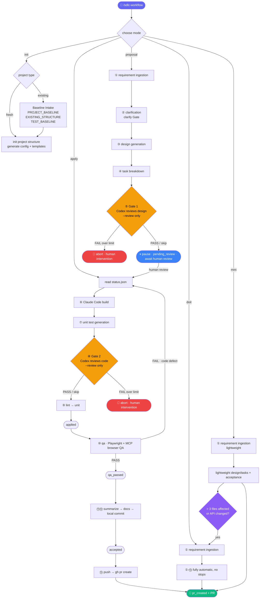

# Design Philosophy · SDLC Workflow Suite

<p align="center"><b>English</b> · <a href="./DESIGN-PROMO.zh-CN.md">简体中文</a></p>

> **Make the AI work by engineering rules, not free improvisation.**
>
> A full-lifecycle SDLC automation skill for Claude Code / Codex — from requirement breakdown to PR, with a human review gate, optional design/code review, and browser QA in between; every step produces artifacts, evidence, and recoverable state.

> 📖 **What this doc is**: the "**why it is designed this way**" among the three docs, good for evangelism and deep understanding. To install / get started see [README](./README.md); for the full mechanics see [workflow-overview](./docs/workflow-overview.md) (Chinese).

---

## Why you need it

You are already coding with Claude Code / Cursor / Codex. But you have probably run into these situations:

| Pain point | How you handle it today | With this system |
|------------|-------------------------|------------------|
| Model changes the directory layout on its own | Fix it up afterward, or give up | Directory constraints injected as rules, checked by a Gate |
| AI writes code before the design is human-reviewed | Only discover the wrong direction after it's written | proposal pauses for human review; apply only starts after |
| "It's done" when nothing was actually tested | Manually verify one by one | qa requires real browser-interaction evidence and a report |
| Existing project rebuilt as if new when handed to AI | Repeatedly explain "don't touch the current architecture" | Intake before building; baseline locks the existing structure |
| Review depends on you reading the diff | Skip it when there's too much | With `--review`, Codex CLI reviews automatically; the Gate stops on failure |
| commit / PR done in one shot, hard to roll back | Only option is reset | accept commits locally only; pr pushes after you confirm |
| Forget what you changed a couple days later | Dig through the Git log and guess | Each requirement produces its own iteration directory |
| Multiple requirements / agents want to run in parallel | Shared work dir, stepping on each other | worktree: git worktree isolation + auto ports + a registry |

**In one sentence**: an SDLC system that constrains AI behavior with an **engineering contract** instead of prompt tricks.

---

## Understand what it does in 30 seconds

```
You state a requirement
  ↓
proposal: requirements → design → tasks (split by track)   ← artifacts
  ↓
[optional Gate 1] Codex CLI reviews the design (--review)  ← gating
  ↓
⏸ pause, wait for human review                            ← human gate
  ↓
apply: Claude Code implements per tasks + unit tests + lint ← constraints
  ↓
[optional Gate 2] Codex CLI reviews the code (--review)    ← gating
  ↓
qa: Playwright scripts + Playwright MCP browser QA         ← acceptance
  ↓
accept: summarize → update docs → local commit             ← local finalize
  ↓
pr: git push → gh pr create                                ← remote ship
```

The five main-line commands: **proposal → apply → qa → accept → pr**. Build, browser QA, local finalize, and remote ship are independent, with clear boundaries, each re-runnable on its own.

---

## Core commands

```bash
# Initialize / onboard a project (optional args: review=1 branch=feat/ test-framework=jest)
sdlc-init "review=1"

# Break down the requirement → pause for human review
sdlc-proposal Add a user login module

# After review passes: build + unit tests + lint (no commit)
sdlc-apply

# Browser QA (Playwright scripts + MCP execution)
sdlc-qa

# QA passed → update docs + local commit
sdlc-accept

# Local looks good → push and create the PR
sdlc-pr

# —— or all in one shot ——
sdlc-doit --qa Add a user login module   # fully automatic, includes browser QA, straight to a PR
sdlc-mini Change the homepage background to black   # lightweight flow for tiny changes
```

Recommended flow: `proposal → human review → apply → qa → accept → pr`. worktree is not a different pipeline — it provides an isolated parallel execution environment for these modes.

> **Single entry point**: each stage is a skill (`sdlc-init` / `sdlc-proposal` / …); Claude Code and Codex **share one skill set** — there is no separate slash-command set. Trigger by stating intent or, in Claude Code, `/sdlc-proposal`.

---

## Design philosophy

### 1. Structural constraints over model intelligence

Rather than telling the model via prompt "please don't mess with the directories," structural rules are injected directly into the workflow and checked by a Gate:

```
✅ Allowed:   apps/web, apps/server, packages/*
🚫 Forbidden: model inventing web/, api/, server/, frontend/, backend/
```

### 2. Existing projects are the norm

Real projects almost never start from scratch. Once the system detects an existing project, it runs an intake first:

```
Detect package.json, .git/, src/ → classify as existing project
  ↓
.claude/PROJECT_BASELINE.md     ← lock the current tech stack
.claude/EXISTING_STRUCTURE.md   ← lock the current directory layout
.claude/TEST_BASELINE.md        ← inventory the current test capability
  ↓
All subsequent design must reference the baseline, no free-form refactor of the original project
```

### 3. Human review gate: design passes a human before any coding

After proposal breaks the requirement into requirements / design / tasks, it **pauses** (`pending_review`) and waits for a human to confirm the design direction; only then does apply start coding — so the AI never decides everything alone. Low-confidence requirements also get a **clarification Gate**: they must be clarified first, never silently assumed and then designed.

### 4. Dual-model gating: optional but never downgraded

```
Claude Code → generates code and design
Codex CLI   → reviews independently (Gate 1 reviews design, Gate 2 reviews code)

Gates are off by default, enabled with --review
Once enabled: review fails → revise → re-review (up to REVIEW_MAX_ROUNDS rounds)
              review tool unavailable → abort, ❌ never silently skipped
```

### 5. Evidence first

All conclusions are tiered:

| Tier | Meaning | Source |
|------|---------|--------|
| **Verified** | a verified fact | real files, command output, test reports, browser screenshots |
| **Claimed** | merely asserted, not verified | handoff narration, model summary, verbal explanation |

**Final pass standard**: the qa command's real browser-interaction evidence via Playwright + Playwright MCP, not the model's self-report.

### 6. Commit and ship decoupled

accept finalizes the change **locally** (update docs + commit) so you can review the local diff; once confirmed, use pr to push and ship. Separating local finalize from remote ship makes rollback easy — pr is the only command that touches the remote / GitHub.

### 7. Resumable, interruption-proof

Each requirement produces a structured iteration directory, with `status.json` recording the phase:

```
docs/iterations/2026-03-27/
  ├── 001-user-login-feature/
  │   ├── requirements.md / design.md / tasks.md
  │   └── status.json   ← pending_review → applied → qa_passed → accepted → pr_created
  └── 002-password-reset-fix/ ...
```

After an interruption, the next session reads the iteration artifacts + status.json and resumes.

### 8. Parallel development isolated with worktree

Real development involves multiple requirements, urgent hotfixes, and multi-agent collaboration at once. The conflict points are the shared work directory, shared config, and shared dev-server ports — not the branch itself. So the system builds parallelism directly on `git worktree`:

```
git worktree add ../wt-001-user-login-feature
  ├── auto seq/slug/branch naming (aligned with the iteration directory)
  ├── auto-copy the main repo's .claude/.sdlc-config* (gitignored, not carried over by worktree)
  ├── auto-rewrite PORT=3000+seq, API_PORT=4000+seq
  ├── write .worktrees/worktree-registry.json (multi-agent coordination bus)
  └── subsequent proposal / apply / qa / accept / pr run independently inside the worktree
```

After merging, `worktree remove` or `worktree gc` cleans up in one step. The Git object store is shared, so disk usage is mostly `node_modules`.

---

## Full flow diagram


```mermaid
flowchart TD
    START([🚀 /sdlc-workflow]) --> MODE{choose mode}
    MODE -->|init| DETECT{project type}
    MODE -->|proposal| REQ_PROP[① requirement ingestion]
    MODE -->|apply| APPLY_START[read status.json]
    MODE -->|doit| REQ_FULL[① requirement ingestion]
    MODE -->|mini| REQ_MINI[① requirement ingestion<br/>lightweight]

    DETECT -->|fresh| INIT[init project structure<br/>generate config + templates]
    DETECT -->|existing| INTAKE[Baseline Intake<br/>PROJECT_BASELINE<br/>EXISTING_STRUCTURE<br/>TEST_BASELINE]
    INTAKE --> INIT

    %% ===== proposal flow =====
    REQ_PROP --> CLARIFY_P[② clarification<br/>clarify Gate]
    CLARIFY_P --> DESIGN_P[③ design generation]
    DESIGN_P --> TASKS_P[④ task breakdown]
    TASKS_P --> GATE1_P{⑤ Gate 1<br/>Codex reviews design<br/>--review only}
    GATE1_P -->|PASS / skip| PAUSE([⏸ pause · pending_review · await human review])
    GATE1_P -->|FAIL over limit| ABORT_P([🛑 abort · human intervention])
    PAUSE -->|human review| APPLY_START

    %% ===== apply flow =====
    APPLY_START --> DEV[⑥ Claude Code build]
    DEV --> TESTGEN[⑦ unit test generation]
    TESTGEN --> GATE2{⑧ Gate 2<br/>Codex reviews code<br/>--review only}
    GATE2 -->|PASS / skip| TEST[⑨ lint → unit]
    GATE2 -->|FAIL over limit| ABORT2([🛑 abort · human intervention])
    TEST --> A_END([applied])

    %% ===== qa / accept / pr =====
    A_END --> QA[⑩ qa · Playwright + MCP browser QA]
    QA -->|PASS| Q_END([qa_passed])
    QA -->|FAIL · code defect| APPLY_START
    Q_END --> ACCEPT[⑪⑫ summarize → docs → local commit]
    ACCEPT --> AC_END([accepted])
    AC_END --> PR[⑬ push → gh pr create]
    PR --> DONE([🎉 pr_created + PR])

    %% ===== doit fully automatic =====
    REQ_FULL --> DOIT_FLOW[①-⑬ fully automatic, no stops]
    DOIT_FLOW --> DONE

    %% ===== mini lightweight =====
    REQ_MINI --> MINI_FLOW[lightweight design/tasks + acceptance]
    MINI_FLOW --> DONE
    MINI_FLOW --> UPGRADE{> 3 files affected<br/>or API changed?}
    UPGRADE -->|yes| REQ_FULL

    style GATE1_P fill:#f59e0b,color:#000
    style GATE2 fill:#f59e0b,color:#000
    style ABORT_P fill:#ef4444,color:#fff
    style ABORT2 fill:#ef4444,color:#fff
    style DONE fill:#10b981,color:#fff
    style START fill:#6366f1,color:#fff
    style UPGRADE fill:#8b5cf6,color:#fff
    style PAUSE fill:#3b82f6,color:#fff
```

---

## System architecture

```
┌───────────────────────────────────────────────────────┐
│  Skill Repository Layer (install once, reuse across projects)│
│                                                       │
│  sdlc-workflow/                                       │
│  ├── SKILL.md              entry orchestration (Orchestrator)│
│  ├── references/           per-step detailed specs (Workers)│
│  ├── templates/            init templates             │
│  └── scripts/              init / update / worktree scripts│
│                                                       │
└───────────────────┬───────────────────────────────────┘
                    │ init / runtime load (project overrides global)
┌───────────────────▼───────────────────────────────────┐
│  Project Runtime Layer (per-project, independent)      │
│                                                       │
│  .claude/CLAUDE.md         project-level AI instructions│
│  .claude/ARCHITECTURE.md   architecture baseline      │
│  .claude/SECURITY.md       security conventions       │
│  .claude/CODING_GUIDELINES.md  coding conventions     │
│  .claude/PROJECT_BASELINE.md   existing-project baseline│
│  .claude/EXISTING_STRUCTURE.md existing directory layout│
│  .claude/TEST_BASELINE.md      existing test baseline │
│  .claude/.sdlc-config      runtime config (gitignored)│
│  .claude/rules/            workflow rules             │
│  docs/iterations/          per-iteration artifacts    │
│  tests/unit|e2e|reports/   test artifacts             │
│  apps/web|server · packages/*  business code / shared modules│
│                                                       │
└───────────────────────────────────────────────────────┘
```

---

## mini mode: not "skip the flow"

Running the full flow for a one-line CSS or copy change is too heavy; but skipping entirely lets the change get out of control. mini is designed to be **lightweight but with a floor**:

| Aspect | doit (full) | mini (lightweight) |
|--------|-------------|--------------------|
| requirements / design / tasks | full | lightweight (but required) |
| Gate 1 / Gate 2 (`--review`) | full Codex review | Codex mini review |
| Unit tests | full | decided by capability detection |
| Browser QA (`--qa`) | Playwright + MCP | same, **not trimmed** |
| Docs update | full update | mini report |

**Core principle**: browser QA cannot be trimmed — it is the final pass standard. **Auto-upgrade**: if mini finds it touches > 3 files, changes an API, or changes the data model, it switches to doit.

---

## Testing pipeline

```
Stage 1   npx <LINT_TOOL> .            fast static check (eslint / biome)
  ↓
Stage 2   npx <TEST_FRAMEWORK>         unit tests (jest / vitest / mocha)
  ↓ —— above run by apply (⑨ test-pipeline), no browser ——
Stage 3   qa: Playwright scripts       E2E script generation (track: qa)
  ↓
Stage 4   Playwright MCP               real browser-interaction QA ← this is the pass standard
```

> **Key**: apply only runs lint + unit; browser QA is a separate `qa` command. Final pass requires real browser-interaction evidence via Playwright MCP, not the model's self-report.

---

## Configuration at a glance

All in `.claude/.sdlc-config` (`KEY=VALUE`, generated and gitignored by init; global defaults can go in `~/.claude/.sdlc-config`, with project-level overriding global):

```bash
# All have defaults, override as needed
TEST_FRAMEWORK=jest          # jest | vitest | mocha
LINT_TOOL=eslint             # eslint | biome
E2E_FRAMEWORK=playwright     # browser QA framework (qa command)
TEST_BOOTSTRAP_POLICY=report # report | auto | never
REVIEW_MAX_ROUNDS=1          # max Gate/Test loop rounds (applies with --review)
GIT_BRANCH_PREFIX=feat/      # branch prefix
COMMIT_TYPE=                 # empty infers from iteration type
COMMIT_SCOPE=                # empty auto-infers
PR_TEMPLATE=                 # path to a custom PR body template
```

`TEST_BOOTSTRAP_POLICY`: `report` (detect gaps and only report, default for existing) / `auto` (auto-provision, default for fresh) / `never` (don't install, only report and block).

---

## Install

> Supports both the **Claude Code** and **Codex** runtimes.

```bash
# Claude Code (plugin marketplace, recommended)
/plugin marketplace add evan-e2438927/sdlc-workflow
/plugin install sdlc-full@sdlc-workflow

# Codex / generic (skills CLI)
npx skills add evan-e2438927/sdlc-workflow -y
```

Verify: run `sdlc-init` in any project directory; seeing the init summary means the install succeeded.

---

## Compared with other approaches

| | Bare Claude Code | Cursor Rules | This SDLC Workflow |
|--|------------------|--------------|--------------------|
| Directory constraints | ❌ via prompt | ⚠️ configurable rules, no runtime enforcement | ✅ injected into the workflow, enforced at runtime |
| Design review | ❌ | ❌ | ✅ Codex CLI Gate 1 (`--review`) |
| Human review gate | ❌ | ❌ | ✅ proposal pauses → human → apply |
| Code review | ❌ | ❌ | ✅ Codex CLI Gate 2 (`--review`) |
| Browser QA | ⚠️ narrated | ⚠️ narrated | ✅ qa: Playwright + MCP evidence |
| Commit / ship separation | ❌ one shot | ❌ | ✅ accept local / pr remote |
| Resumable iterations | ❌ relies on chat history | ❌ | ✅ iteration dir + status.json |
| Safe onboarding of existing projects | ❌ often rebuilt | ⚠️ hit or miss | ✅ intake → baseline → constraints |
| Parallel-dev isolation | ❌ single-repo serial | ❌ | ✅ git worktree + port isolation + registry |

---

## Roadmap

### Implemented ✅

- [x] Single entry, multiple modes (init / update / proposal / apply / qa / accept / pr / doit / mini / review / worktree)
- [x] Fresh + Existing dual-track detection, baseline intake
- [x] Five-command main line + build/QA/finalize/ship stage separation
- [x] Optional dual-model Gate (Claude generates + Codex reviews, `--review`)
- [x] proposal human review gate + clarification Gate (low-confidence clarified before design)
- [x] status.json state management + structured iteration directories
- [x] qa: Playwright + MCP browser QA as the final pass standard
- [x] Unified context loading (global + project override) + config converged to `.claude/.sdlc-config`
- [x] Git Worktree parallel-dev isolation (auto branch / port / config copy / registry)
- [x] Published as an installable plugin (Claude Code plugin + skills CLI)
- [x] Incremental update: drift-aware scaffold sync after a plugin upgrade

### Roadmap 🗺️

- [ ] Example projects: fresh + existing live demos
- [ ] Runner compatibility matrix (Claude Code / Codex / Cursor) + demo video
- [ ] CI/CD integration mode
- [ ] Visual status-tracking dashboard
- [ ] Automatic doctor / diagnose tool

---

## FAQ

**Q: Does it only support Better-T-Stack?**
> No. Better-T-Stack is the default constraint template; you can customize directory rules in `workflow-rules.md.tpl`. For existing projects, the real structure from intake takes precedence.

**Q: Can I use it without Codex CLI?**
> Yes. Gates are optional (enabled only with `--review`). Once enabled, an unavailable Codex aborts rather than silently skips.

**Q: Does it support projects other than TypeScript?**
> Yes. Set `TEST_FRAMEWORK` and `LINT_TOOL`; the flow itself is language-agnostic.

**Q: How do I choose between proposal / doit / mini?**
> Need to review the design → proposal + apply (+ qa + accept + pr). Fully trust the AI → doit. CSS / copy / small UI → mini.

**Q: Why are accept and pr separate?**
> accept finalizes locally only so you can review the local diff first; after confirming, use pr to push and ship. Decoupling local from remote makes rollback easy.

**Q: What if the session is interrupted?**
> The next session reads `docs/iterations/` and the `status.json` phase to resume; all intermediate artifacts are persisted.

**Q: What about parallel requirements / interrupting hotfixes?**
> Use `worktree create` to open an isolated work tree per requirement; branches / ports / config are isolated automatically, and the registry syncs multi-agent state; after merging, `worktree gc` reclaims in one step.

---

## License

[MIT](./sdlc-workflow/LICENSE)
