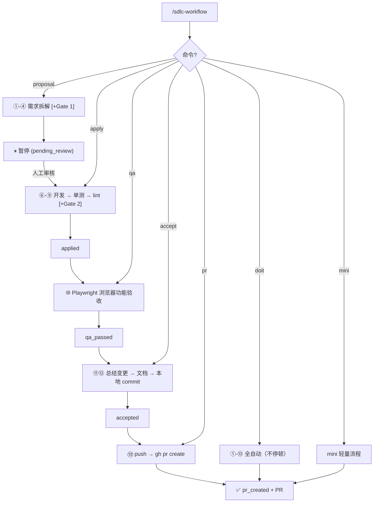

# 企业级 SDLC Workflow — AI 驱动的自动化软件交付流水线

<p align="center">
  <strong>🏭 用 Claude Code 做开发 · 用 Codex CLI 做审查 · 用浏览器自动化做验收 · 全程留痕可恢复</strong>
</p>

<p align="center">
  <a href="./DESIGN-PROMO.md#设计哲学">💡 设计理念</a> ·
  <a href="./examples/30-second-demo.md">⚡ 30 秒上手</a> ·
  <a href="./sdlc-workflow/SKILL.md">🔧 核心规范</a>
</p>

---

## 这是什么？

一套用在 [Claude Code](https://claude.ai/code) 与 [Codex](https://github.com/openai/codex) 中的 **Skill 插件**（两端共用同一套 skill，单一入口），把软件交付拆成五个可审、可恢复、有产物的阶段，让 AI 按工程 contract 而非 prompt 技巧来推进：

```
主线：proposal → apply → qa → accept → pr
       拆解      开发     验收    定稿     发布
```

| 阶段 | 命令 | 做什么 | 产出 phase |
|------|------|--------|-----------|
| 需求拆解 | `proposal` | 需求 → 澄清 → 设计 → 任务（按 track 拆分）→ [Gate1] → **暂停等人工审核** | pending_review |
| 开发 | `apply` | 实现 frontend/backend/unit-test → 单元测试 → [Gate2] → lint+unit | applied |
| 浏览器验收 | `qa` | 把 qa track 写成 Playwright 脚本并通过 Playwright MCP 执行 | qa_passed |
| 定稿 | `accept` | 总结变更 → 更新文档 → **本地 commit**（不 push） | accepted |
| 发布 | `pr` | `git push` → `gh pr create`（唯一与远程交互的动作） | pr_created |

外加三条辅助线：
- `init`：初始化 / 接入项目，生成 baseline 锁定结构
- `doit`：把五个阶段全自动串起来（`--qa` 含浏览器验收），一路到 PR
- `mini`：小任务轻量流程，但 Gate 与验收不跳过
- `worktree`：基于 git worktree 隔离多条并行 pipeline
- `review`：单独跑 Codex Gate1/Gate2

**核心特点**：
- 🤖 **AI 驱动**：从需求到 PR 全流程自动化，每步都有产物、有证据、可恢复
- 🎯 **阶段分离**：开发（apply）、浏览器验收（qa）、本地定稿（accept）、远程发布（pr）各自独立，边界清晰、可单独重跑
- 🧍 **人工审核门**：proposal 后暂停，设计经人工确认再开发，避免 AI 全权拍板
- 🔒 **双模型把关**：Claude Code 生成，Codex CLI 独立审查（`--review` 启用，不降级、不跳过）
- 🧪 **证据链验收**：qa 用 Playwright 脚本 + Playwright MCP 做浏览器功能验收并出报告，不靠"我测完了"
- 🧭 **统一上下文加载**：规范来源（全局 `~/.claude/` + 项目 `.claude/`，项目覆盖全局）只定义一次，单一入口收敛
- 📦 **配置收敛**：项目配置统一放 `.claude/.sdlc-config`，无散落的根目录 `.env`
- 🔧 **可恢复**：每轮需求生成结构化 iteration 目录，`status.json` 记录 phase，会话中断后下个 session 可续跑
- 🛡️ **老项目安全**：existing project 先 intake 生成 baseline，防止 AI 重建你的目录结构
- 🌲 **Worktree 并行**：多需求 / 多 Agent 同时跑，自动分配端口、隔离分支与配置

---

## 为什么需要它

你已经在用 Claude Code / Cursor / Codex 写代码了，但大概率遇到过：

| 痛点 | 现在怎么处理 | 用了这套系统 |
|------|------------|-------------|
| 老项目交给 AI 被当新项目重建 | 反复解释"别动现有架构" | 先 intake 再开发，baseline 锁定结构 |
| 模型擅自改目录结构 | 事后人工修 | 目录约束作为规则注入，Gate 校验 |
| 设计没人审就直接写代码 | 写完才发现方向错 | proposal 暂停等人工审核，apply 才动手 |
| 说"已完成"实际没测 | 手动逐个验证 | qa 必须有浏览器交互证据与报告 |
| 审查全靠自己看 diff | 看不过来就跳过 | Codex CLI 自动审查，Gate 失败就停 |
| commit / PR 一把梭，难回退 | 出错只能 reset | accept 只本地 commit，确认后 pr 才推送发布 |
| 配置散落、含密钥 | `.env` 到处放 | 统一 `.claude/.sdlc-config`，gitignored |
| 多需求并行卡在串行 | 排队，hotfix 也得等 | worktree：独立工作树 + 分支 + 端口隔离 |

**一句话**：用**工程 contract** 而非 prompt 技巧来约束 AI 行为的 SDLC 系统。

---

## 与其他方案的对比

| | 裸用 Claude Code | Cursor Rules | SDLC Workflow |
|--|-----------------|--------------|---------------|
| 目录结构约束 | ❌ 靠 prompt | ⚠️ 可配规则，无强制 | ✅ 注入 workflow，运行时强制 |
| 设计审查 | ❌ | ❌ | ✅ Codex CLI Gate 1 |
| 人工审核门 | ❌ | ❌ | ✅ proposal 暂停 → 人工 → apply |
| 代码审查 | ❌ | ❌ | ✅ Codex CLI Gate 2 |
| 浏览器验收 | ⚠️ 口述 | ⚠️ 口述 | ✅ qa：Playwright + MCP 证据 |
| 提交 / 发布分离 | ❌ 一把梭 | ❌ | ✅ accept 本地 commit / pr 远程发布 |
| 迭代可恢复 | ❌ 靠聊天记录 | ❌ | ✅ iteration 目录 + status.json |
| 老项目安全接入 | ❌ 经常被重建 | ⚠️ 看运气 | ✅ intake → baseline → 约束 |
| 并行开发隔离 | ❌ 单仓串行 | ❌ | ✅ git worktree + 端口隔离 |

---

## 安装

> 支持 **Claude Code** 与 **Codex** 两种运行时。

### Claude Code（plugin marketplace，推荐）

在 Claude Code 终端中执行：

```bash
# 1. 注册 marketplace
/plugin marketplace add evan-e2438927/sdlc-workflow

# 2. 安装全套 skill
/plugin install sdlc-full@sdlc-workflow
```

### Codex / 通用（skills CLI）

跨运行时安装，Codex 与其他支持 skills 的环境通用：

```bash
npx skills add evan-e2438927/sdlc-workflow -g -y
```

安装后即可使用 `sdlc-*` 系列 skill：`sdlc-init` / `sdlc-update` / `sdlc-proposal` / `sdlc-apply` / `sdlc-qa` / `sdlc-accept` / `sdlc-pr` / `sdlc-doit` / `sdlc-mini` / `sdlc-review` / `sdlc-worktree`。

> **统一入口**：Claude Code 与 Codex **共用同一套 skill**，不再维护单独的 slash 命令集。触发方式：说出意图（如「用 sdlc 跑 proposal：…」），或在 Claude Code 里 `/sdlc-proposal`。`sdlc-workflow` 是总览/编排 skill，各阶段 skill 是薄入口，指向同一批 `references/`，逻辑单源。

### 手动安装（备选）

<details>
<summary>点击展开</summary>

**全局安装（所有项目可用）**

```bash
git clone https://github.com/evan-e2438927/sdlc-workflow.git ~/.claude/sdlc-workflow-repo
mkdir -p ~/.claude/skills
ln -sf ~/.claude/sdlc-workflow-repo/sdlc-workflow ~/.claude/skills/sdlc-workflow
```

**项目级安装（仅当前项目）**

```bash
cd your-project
git clone https://github.com/evan-e2438927/sdlc-workflow.git .claude/sdlc-workflow-repo
mkdir -p .claude/skills
ln -sf .claude/sdlc-workflow-repo/sdlc-workflow .claude/skills/sdlc-workflow
```

</details>

### 更新

- **Claude Code**：`/plugin update sdlc-full@sdlc-workflow`，再在各项目里跑 `sdlc-update` 同步脚手架
- **Codex / 通用**：`npx skills update`，或在 clone 目录 `git pull`

### 依赖项

| 工具 | 用途 | 安装 |
|------|------|------|
| [Claude Code](https://claude.ai/code) | AI 开发代理 | 官网安装 |
| [Codex CLI](https://github.com/openai/codex) | Gate 1/2 独立审查（`--review`） | `npm i -g @openai/codex` |
| [GitHub CLI](https://cli.github.com/) | `pr` 命令创建 PR | `brew install gh` |
| [Playwright MCP](https://github.com/microsoft/playwright-mcp) | `qa` 浏览器功能验收 | Claude Code 挂载 MCP |
| [GitHub MCP](https://github.com/github/github-mcp-server)（可选） | PR 增强 | Claude Code 挂载 MCP |

> Gate 是可选的（`--review` 时启用）；但一旦启用，Codex CLI 不可用必须中止，不会自动跳过。

---

## 快速开始

```bash
# 1. 初始化 / 接入项目（可选参数：review=1 branch=feat/ test-framework=jest）
sdlc-init "review=1"

# 2. 需求拆解（推荐流程，结束后暂停等人工审核）
sdlc-proposal 增加用户登录模块，支持邮箱和手机号注册

# 3. 审阅 proposal 产物 → 确认后开发（开发 + 单元测试 + lint，不提交）
sdlc-apply

# 4. 浏览器功能验收（Playwright 脚本 + MCP 执行）
sdlc-qa

# 5. 验收通过 → 更新文档 + 本地 commit
sdlc-accept

# 6. 确认本地提交无误 → 推送并创建 PR
sdlc-pr

# —— 或者一把梭 ——
sdlc-doit --qa 增加用户登录模块      # 全自动，含浏览器验收，一路到 PR
sdlc-mini 把按钮颜色改成蓝色          # 小任务轻量流程
```

**推荐流程**：`proposal → 人工审核 → apply → qa → accept → pr`，确保设计经人工确认、变更经浏览器验收、发布前可在本地复核 commit。

---

## Skill 一览（统一入口）

每个阶段是一个 skill，Claude Code 与 Codex 共用；说出意图或在 Claude Code 里 `/<skill>` 触发。

| Skill | 参数 | 适用场景 | phase |
|------|------|---------|-------|
| `sdlc-init` | `[key=value …]` | 项目接入，生成配置与 baseline | — |
| `sdlc-update` | `[项目目录]` | 两阶段升级同步：阶段一安全同步脚手架（幂等，不覆盖用户内容）；阶段二漂移感知增量刷新（基线自动刷新、用户文档逐项确认） | — |
| `sdlc-proposal` | `<需求> [--review]` | 需求拆解（①-④）→ 等待人工审核 | pending_review |
| `sdlc-apply` | `[--review] [迭代目录]` | 开发 + 单元测试 + lint（⑥-⑨，不提交） | applied |
| `sdlc-qa` | `[迭代目录]` | Playwright 浏览器功能验收（⑩） | qa_passed |
| `sdlc-accept` | `[迭代目录]` | 总结变更 → 更新文档 → 本地 commit（⑪⑫） | accepted |
| `sdlc-pr` | `[迭代目录]` | push → 创建 PR（⑬，唯一远程动作） | pr_created |
| `sdlc-doit` | `[--review] [--qa] <需求>` | 全自动，一路到 PR（①-⑬） | — |
| `sdlc-mini` | `[--review] [--qa] <小任务>` | 微小任务轻量流程 | — |
| `sdlc-review` | `<proposal\|code> <迭代目录>` | 单独跑 Codex Gate 1 / Gate 2 | — |
| `sdlc-worktree` | `create <slug> <type> \| list \| status \| remove <seq\|slug> \| gc` | 多需求并行 / 多 Agent | — |

### 参数说明

- 记号：`< >` 必填，`[ ]` 可选，`|` 多选一。
- `--review`：启用 Codex 审查门禁（proposal 的 Gate 1 设计审查 + apply 的 Gate 2 代码审查）；不加则跳过 Gate，仅本地 lint/unit。
- `--qa`：在 doit / mini 流程中插入 Playwright 浏览器功能验收（步骤 ⑩）。
- `迭代目录`：形如 `docs/iterations/YYYY-MM-DD/<seq>-<slug>-<type>/`；**省略时自动定位**最近一个匹配 phase 的迭代。
- `<需求>` / `<小任务>` 输入格式：纯文本、`file:///本地路径`、或 URL（自动经 Playwright MCP 提取正文）。
- `sdlc-init` 的 `key=value` 配置（均可选）：`review=<n>`（REVIEW_MAX_ROUNDS）、`branch=<prefix>`（GIT_BRANCH_PREFIX）、`test-framework=<jest|vitest|mocha>`、`lint=<eslint|biome>`。
- `sdlc-worktree` 的 `<type>`：`feature | fix | refactor | docs | test | chore`。

**为什么 accept 和 pr 分开**：accept 把变更定稿到**本地**（更新文档 + commit），你可以先 review 本地 diff；确认无误后再用 `pr` 推送并发布。本地定稿与远程发布解耦，出错好回退。

**mini 不是"跳过流程"**：浏览器验收不精简、Gate 不跳过；影响 > 3 文件或改 API/数据模型时自动升级到 doit。

**worktree 不是"另开一个流程"**：它只负责隔离工作区与分支，pipeline 仍走 proposal/apply/qa/accept/pr。

---

## Pipeline 流程图



每轮迭代的状态记录在 `docs/iterations/.../status.json`，会话中断后下个 session 据此续跑：

```json
{
  "phase": "pending_review | approved | rejected | applied | qa_passed | accepted | pr_created",
  "proposal_at": "2026-04-13T14:00:00+08:00",
  "reviewed_at": null,
  "applied_at": null,
  "accepted_at": null,
  "pr_url": null,
  "iter_dir": "docs/iterations/2026-04-13/001-user-login-feature/"
}
```

---

## 统一上下文加载

所有命令在执行前经**单一入口**加载规范，规范清单只在 [`references/context-loader.md`](sdlc-workflow/references/context-loader.md) 定义一次：

```
加载顺序（后者覆盖前者）：
  1. 全局级  ~/.claude/            ← 用户跨项目通用规范
  2. 项目级  <project>/.claude/    ← 项目专属规范，覆盖全局
```

每层加载 `CLAUDE.md` / `ARCHITECTURE.md` / `SECURITY.md` / `CODING_GUIDELINES.md` / `rules/*.md`；existing project 额外加载 baseline 三件套；运行时配置读 `.claude/.sdlc-config`。命令与各 reference 不再各自罗列 `.claude/*` 清单。

---

## 并行开发（Worktree 模式）

基于 `git worktree` 让一个仓库同时存在多个工作区，每个工作区跑独立 pipeline。

```bash
# 创建并行工作区（自动分配 seq、分支、端口、复制 .claude/.sdlc-config*）
sdlc-worktree create user-login feature
sdlc-worktree create payment-bug fix

# 进入工作区跑正常 pipeline
cd ../wt-001-user-login-feature
sdlc-proposal "用户登录功能"

# 全局总览 / 列表 / 清理
sdlc-worktree status
sdlc-worktree list
sdlc-worktree remove 001
sdlc-worktree gc
```

| 资源 | 隔离方式 |
|------|---------|
| 工作目录 | `../wt-<seq>-<slug>-<type>/`，主仓的兄弟目录 |
| 分支 | `{GIT_BRANCH_PREFIX}{slug}-{date}-wt{seq}`，git 强制独占 |
| dev server 端口 | `PORT=3000+seq, API_PORT=4000+seq`，写入该 worktree 的 `.claude/.sdlc-config` |
| 配置 | 从主仓复制 `.claude/.sdlc-config*`（gitignored，不随 git worktree 带过去） |
| 注册表 | `.worktrees/worktree-registry.json`（提交到 main，作为多 Agent 协调总线） |

详见 [parallel-dev.md](sdlc-workflow/references/parallel-dev.md)，脚本见 [sdlc-worktree.sh](sdlc-workflow/scripts/sdlc-worktree.sh)。

---

## 目录结构

仓库本身是一个**多运行时插件**：Claude Code 与 Codex 共用同一套 `skills/`，逻辑单源在 `sdlc-workflow/references/`。

```
sdlc-workflow/（repo 根）
├── skills/                 # 统一入口：每个阶段一个 skill（两端共用）
│   ├── sdlc-workflow/      # → 软链到 ../sdlc-workflow（总览/编排 skill）
│   ├── sdlc-init/  sdlc-proposal/  sdlc-apply/  sdlc-qa/  sdlc-accept/
│   ├── sdlc-pr/  sdlc-doit/  sdlc-mini/  sdlc-review/  sdlc-update/  sdlc-worktree/
│   └──   每个含 SKILL.md（薄入口，指向 references/）
├── .claude-plugin/         # Claude Code 清单（marketplace.json + plugin.json，自动发现 skills/）
├── .codex-plugin/          # Codex 清单（plugin.json，skills: ./skills/）
└── sdlc-workflow/          # 核心 Skill 内容（被 skills/sdlc-workflow 引用）
```

```
sdlc-workflow/              # 核心 Skill
├── SKILL.md                # 主流程规范（Orchestrator）
├── references/             # 步骤详细规范（Workers）
│   ├── pipeline-overview.md
│   ├── context-loader.md     # 统一上下文加载入口
│   ├── flow-proposal.md      # 需求拆解流程
│   ├── flow-apply.md         # 开发流程
│   ├── flow-qa.md            # 浏览器功能验收流程
│   ├── flow-accept.md        # 验收提交流程（文档 + 本地 commit）
│   ├── flow-mini.md          # 小任务轻量流程
│   ├── parallel-dev.md       # worktree 并行开发
│   ├── 00-existing-project-intake.md
│   ├── 01-requirements-ingestion.md
│   ├── 02-requirements-clarifier.md
│   ├── 03-design-generator.md
│   ├── 04-task-generator.md
│   ├── 05-design-reviewer.md   # Gate 1
│   ├── 07-test-generator.md    # 单元测试生成
│   ├── 08-code-reviewer.md     # Gate 2
│   ├── 09-test-pipeline.md     # lint + unit
│   ├── 10-docs-updater.md
│   ├── 11-git-committer.md     # 本地 commit + Conventional Commits 规范
│   ├── 12-pr-creator.md        # push + PR
│   └── micro-change-mode.md
├── scripts/                # 初始化与并行开发脚本
│   ├── init-project.sh
│   ├── update-project.sh         # 同步最新脚手架到已初始化项目
│   ├── sdlc-worktree.sh
│   └── update-workflow-config.sh
└── templates/              # 项目模板
    ├── CLAUDE.md.tpl
    ├── workflow-rules.md.tpl
    ├── sdlc-config.tpl        # → 生成 .claude/.sdlc-config
    ├── ARCHITECTURE.md.tpl
    ├── SECURITY.md.tpl
    └── CODING_GUIDELINES.md.tpl
```

### 目标项目结构（init 后生成）

```
your-project/
├── .claude/                    # Claude 上下文（统一放置）
│   ├── CLAUDE.md
│   ├── ARCHITECTURE.md
│   ├── SECURITY.md
│   ├── CODING_GUIDELINES.md
│   ├── PROJECT_BASELINE.md     # existing project
│   ├── EXISTING_STRUCTURE.md
│   ├── TEST_BASELINE.md
│   ├── .sdlc-config            # 配置（gitignored）
│   └── rules/workflow-rules.md
├── docs/iterations/YYYY-MM-DD/<seq>-<slug>-<type>/
│   ├── requirements.md
│   ├── design.md
│   ├── tasks.md
│   └── status.json             # phase: pending_review → applied → qa_passed → accepted → pr_created
├── tests/
│   ├── unit/                   # 单元测试（apply 生成）
│   ├── e2e/                    # Playwright 脚本（qa 生成）
│   └── reports/                # 测试与验收报告
└── .worktrees/                 # worktree 注册表（启用并行后生成）
```

---

## 配置项

统一放在 `.claude/.sdlc-config`（`KEY=VALUE` 格式，`sdlc-init` 自动生成并加入 `.gitignore`）。全局默认可放 `~/.claude/.sdlc-config`，项目级覆盖全局：

| 配置项 | 默认值 | 说明 |
|--------|--------|------|
| `TEST_FRAMEWORK` | `jest` | 单元测试框架（jest/vitest/mocha） |
| `LINT_TOOL` | `eslint` | Lint 工具（eslint/biome） |
| `E2E_FRAMEWORK` | `playwright` | 浏览器验收框架（qa 命令） |
| `TEST_BOOTSTRAP_POLICY` | `report` | 测试基础设施缺口处理（report/auto/never） |
| `REVIEW_MAX_ROUNDS` | `1` | Gate/Test 最大循环轮数 |
| `GIT_BRANCH_PREFIX` | `feat/` | Git 分支前缀 |
| `COMMIT_TYPE` | （空） | Conventional Commits type，留空按迭代 type 推断 |
| `COMMIT_SCOPE` | （空） | Conventional Commits scope，留空自动推断 |
| `PR_TEMPLATE` | （空） | 自定义 PR body 模板路径 |

提交统一遵循 [Conventional Commits 1.0.0](https://www.conventionalcommits.org/zh-hans/v1.0.0/)，权威定义见 [11-git-committer.md](sdlc-workflow/references/11-git-committer.md)。

---

## FAQ

**Q: 没有 Codex CLI 能用吗？**
> 能。Gate 是可选的（`--review` 时才启用）。但一旦启用，Codex 不可用会中止而不是跳过。

**Q: 为什么 accept 和 pr 要分开？**
> accept 只在本地定稿（更新文档 + commit），方便你先 review 本地 diff；确认无误后再用 pr 推送发布。本地与远程解耦，出错好回退。

**Q: 支持 TypeScript 以外的项目吗？**
> 支持。配 `TEST_FRAMEWORK` 和 `LINT_TOOL` 即可，流程本身不依赖特定语言。

**Q: proposal / doit / mini 怎么选？**
> 要审设计 → proposal + apply（+ qa + accept + pr）。完全信任 AI → doit。改 CSS / 文案 / 小 UI → mini。

**Q: 会话中断了怎么办？**
> 下个 session 读 `docs/iterations/` 和 `status.json` 的 phase 即可续跑，所有中间产物已持久化。

**Q: 全局规范和项目规范冲突怎么办？**
> 项目级 `.claude/` 覆盖全局 `~/.claude/`，命令运行时参数（`--review`/`--qa`）优先级最高。

**Q: 多个需求要并行开发怎么办？**
> 用 `worktree create` 给每个需求开独立工作区，分支、端口、`.claude/.sdlc-config` 自动隔离，多个会话互不干扰，合并后 `worktree gc` 清理。

---

## 实践工程案例
- https://github.com/evan-e2438927/btc-trade/pulls
- [梦幻电影院-ERC20](https://movie.coinbasis.org/) ｜ 工程代码: https://github.com/evan-e2438927/dream-castle-cinema

---

## License

[MIT](./sdlc-workflow/LICENSE)
