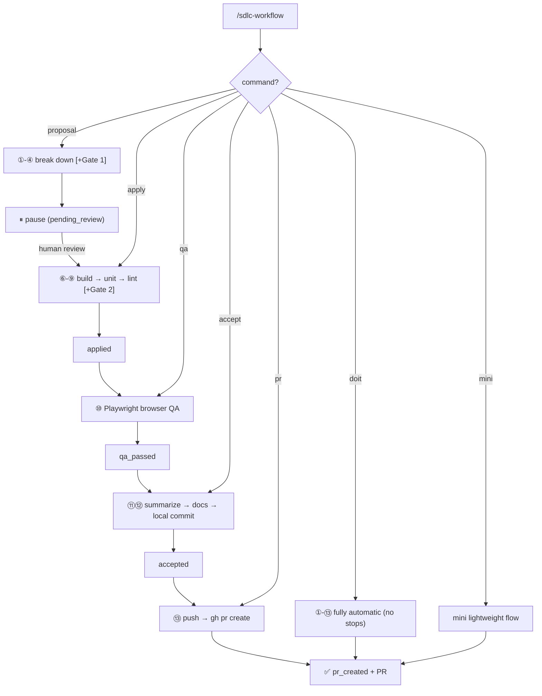

# Enterprise SDLC Workflow — an AI-driven, automated software delivery pipeline

<p align="center"><b>English</b> · <a href="./README.zh-CN.md">简体中文</a></p>

<p align="center">
  <strong>🏭 Claude Code writes · Codex CLI reviews · browser automation verifies · every step traceable and resumable</strong>
</p>

<p align="center">
  <a href="./DESIGN-PROMO.md#design-philosophy">💡 Design philosophy</a> ·
  <a href="./examples/30-second-demo.md">⚡ 30-second start</a> ·
  <a href="./sdlc-workflow/SKILL.md">🔧 Core spec</a>
</p>

---

> **How to read these docs**
> - 🏃 **Want to use it now** → [Install](#install) → [Your first full run](#your-first-full-run)
> - 🤔 **Evaluating whether to adopt** → [Why you need it](#why-you-need-it) → [Compared with other approaches](#compared-with-other-approaches)
> - 🧠 **Want the design rationale** → [DESIGN-PROMO.md · design philosophy](./DESIGN-PROMO.md) ｜ [workflow-overview.md · mechanics (Chinese)](./docs/workflow-overview.md)
>
> **Doc map (three docs, no overlap)**: this **README** = front door + install + command reference; **[DESIGN-PROMO](./DESIGN-PROMO.md)** = why it is designed this way (deep rationale, good for evangelism); **[workflow-overview](./docs/workflow-overview.md)** = the 2-model / 4-stage / command mechanics in full (good for training; currently Chinese only).

---

## What is this?

A **Skill plugin** for [Claude Code](https://claude.ai/code) and [Codex](https://github.com/openai/codex) (one shared skill set across both runtimes, single entry point) that splits software delivery into five reviewable, resumable, artifact-producing stages, so the AI advances by an engineering **contract** rather than prompt tricks:

```
Main line: proposal → apply → qa → accept → pr
           break down  build  verify  finalize  ship
```

| Stage | Command | What it does | Output phase |
|-------|---------|--------------|--------------|
| Break down | `proposal` | requirement → clarify → design → tasks (split by track) → [Gate 1] → **pause for human review** | pending_review |
| Build | `apply` | implement frontend/backend/unit-test → unit tests → [Gate 2] → lint+unit | applied |
| Browser QA | `qa` | turn the qa track into Playwright scripts and run them via Playwright MCP | qa_passed |
| Finalize | `accept` | summarize changes → update docs → **local commit** (no push) | accepted |
| Ship | `pr` | `git push` → `gh pr create` (the only step that touches the remote) | pr_created |

Plus a few auxiliary lines:
- `init`: initialize / onboard a project, generating a baseline that locks the structure
- `doit`: chain all five stages fully automatically (`--qa` includes browser QA), straight to a PR
- `mini`: lightweight flow for tiny changes, but Gates and QA are not skipped
- `worktree`: isolate multiple parallel pipelines via git worktree
- `review`: run Codex Gate 1 / Gate 2 standalone

**Highlights**:
- 🤖 **AI-driven**: full automation from requirement to PR, every step producing artifacts, evidence, and recoverable state
- 🎯 **Stage separation**: build (apply), browser QA (qa), local finalize (accept), and remote ship (pr) are independent — clear boundaries, each re-runnable on its own
- 🧍 **Human review gate**: pause after proposal so the design is human-confirmed before coding, so the AI never decides everything alone
- 🔒 **Dual-model gating**: Claude Code generates, Codex CLI reviews independently (enabled by `--review`; never downgraded, never silently skipped)
- 🧪 **Evidence-chain acceptance**: qa runs real browser verification with Playwright scripts + Playwright MCP and produces a report; success screenshots are stored under `tests/reports/` (gitignored, kept out of the main branch) and embedded into the PR body by `pr` via an isolated `pr-assets` branch — not "trust me, I tested it"
- 🧭 **Unified context loading**: the source of conventions (global `~/.claude/` + project `.claude/`, project overrides global) is defined exactly once, converged at a single entry
- 🧩 **Custom skills discovery**: a project's `.claude/skills/<name>/SKILL.md` is discovered by unified context loading, and the pipeline prefers it at relevant stages (skill first, hand-rolled second); works across both Claude Code and Codex
- 📦 **Config convergence**: project config lives in one place, `.claude/.sdlc-config`, with no scattered root-level `.env`
- 🔧 **Resumable**: each requirement produces a structured iteration directory; `status.json` records the phase, so the next session can continue after an interruption
- 🛡️ **Safe for existing projects**: existing projects run an intake to generate a baseline first, preventing the AI from rebuilding your directory structure
- 🌲 **Worktree parallelism**: multiple requirements / agents run at once, with auto-allocated ports and isolated branches and config

---

## Why you need it

You are already coding with Claude Code / Cursor / Codex, but you have probably hit:

| Pain point | How you handle it today | With this system |
|------------|-------------------------|------------------|
| Existing project rebuilt as if new when handed to AI | Repeatedly explain "don't touch the current architecture" | Intake before building; baseline locks the structure |
| Model changes the directory layout on its own | Fix it up afterward | Directory constraints injected as rules, checked by a Gate |
| Code written before anyone reviews the design | Only discover the wrong direction after it's written | proposal pauses for human review; apply only starts after |
| "It's done" when nothing was actually tested | Manually verify one by one | qa requires real browser-interaction evidence and a report |
| Review depends on you reading the diff | Skip it when there's too much | Codex CLI reviews automatically; the Gate stops on failure |
| commit / PR done in one shot, hard to roll back | Only option is reset | accept commits locally only; pr pushes and ships after you confirm |
| Config scattered, secrets included | `.env` everywhere | Unified `.claude/.sdlc-config`, gitignored |
| Parallel requirements stuck in serial | Queue up; even a hotfix waits | worktree: isolated work tree + branch + ports |

**In one sentence**: an SDLC system that constrains AI behavior with an **engineering contract** instead of prompt tricks.

---

## Compared with other approaches

| | Bare Claude Code | Cursor Rules | SDLC Workflow |
|--|------------------|--------------|---------------|
| Directory constraints | ❌ via prompt | ⚠️ configurable rules, not enforced | ✅ injected into the workflow, enforced at runtime |
| Design review | ❌ | ❌ | ✅ Codex CLI Gate 1 |
| Human review gate | ❌ | ❌ | ✅ proposal pauses → human → apply |
| Code review | ❌ | ❌ | ✅ Codex CLI Gate 2 |
| Browser QA | ⚠️ narrated | ⚠️ narrated | ✅ qa: Playwright + MCP evidence |
| Commit / ship separation | ❌ one shot | ❌ | ✅ accept local commit / pr remote ship |
| Resumable iterations | ❌ relies on chat history | ❌ | ✅ iteration dir + status.json |
| Safe onboarding of existing projects | ❌ often rebuilt | ⚠️ hit or miss | ✅ intake → baseline → constraints |
| Parallel-dev isolation | ❌ single-repo serial | ❌ | ✅ git worktree + port isolation |

---

## Install

> Supports both the **Claude Code** and **Codex** runtimes.

### Claude Code (plugin marketplace, recommended)

Run in the Claude Code terminal:

```bash
# 1. Register the marketplace
/plugin marketplace add evan-e2438927/sdlc-workflow

# 2. Install the full skill set
/plugin install sdlc-full@sdlc-workflow
```

### Codex / generic (skills CLI)

Cross-runtime install, usable from Codex and other skills-capable environments:

```bash
npx skills add evan-e2438927/sdlc-workflow -y
```

> **Note**: the skills CLI's SKILL.md format does not support `-g` (global) install; if you need it globally, use "Manual install" below.

After installing you can use the `sdlc-*` skills: `sdlc-init` / `sdlc-update` / `sdlc-proposal` / `sdlc-apply` / `sdlc-qa` / `sdlc-accept` / `sdlc-pr` / `sdlc-doit` / `sdlc-mini` / `sdlc-review` / `sdlc-worktree`.

> **Single entry point**: Claude Code and Codex **share one skill set** — there is no separate slash-command set. Trigger by stating intent (e.g. "run sdlc proposal: …") or, in Claude Code, `/sdlc-proposal`. `sdlc-workflow` is the overview/orchestration skill; each stage skill is a thin entry pointing at the same `references/`, single source of truth.

### Manual install (fallback)

<details>
<summary>Click to expand</summary>

**Global install (available to all projects)**

```bash
git clone https://github.com/evan-e2438927/sdlc-workflow.git ~/.claude/sdlc-workflow-repo
mkdir -p ~/.claude/skills
ln -sf ~/.claude/sdlc-workflow-repo/sdlc-workflow ~/.claude/skills/sdlc-workflow
```

**Project-level install (current project only)**

```bash
cd your-project
git clone https://github.com/evan-e2438927/sdlc-workflow.git .claude/sdlc-workflow-repo
mkdir -p .claude/skills
ln -sf .claude/sdlc-workflow-repo/sdlc-workflow .claude/skills/sdlc-workflow
```

</details>

### Updating

- **Claude Code**: `/plugin update sdlc-full@sdlc-workflow`, then run `sdlc-update` in each project to sync the scaffold
- **Codex / generic**: `npx skills update`, or `git pull` in the clone directory

### Dependencies

| Tool | Purpose | Install |
|------|---------|---------|
| [Claude Code](https://claude.ai/code) | AI development agent | via official site |
| [Codex CLI](https://github.com/openai/codex) | Independent Gate 1/2 review (`--review`) | `npm i -g @openai/codex` |
| [GitHub CLI](https://cli.github.com/) | `pr` command creates the PR | `brew install gh` |
| [Playwright MCP](https://github.com/microsoft/playwright-mcp) | `qa` browser QA | mount the MCP in Claude Code |
| [GitHub MCP](https://github.com/github/github-mcp-server) (optional) | PR enhancements | mount the MCP in Claude Code |

> Gates are optional (enabled with `--review`); but once enabled, an unavailable Codex CLI aborts the run rather than being silently skipped.

---

## Quick start

```bash
# 1. Initialize / onboard a project (optional args: review=1 branch=feat/ test-framework=jest)
sdlc-init "review=1"

# 2. Break down the requirement (recommended flow; pauses for human review at the end)
sdlc-proposal Add a user login module supporting email and phone registration

# 3. Review the proposal artifacts → after confirming, build (build + unit tests + lint, no commit)
sdlc-apply

# 4. Browser QA (Playwright scripts + MCP execution)
sdlc-qa

# 5. QA passed → update docs + local commit
sdlc-accept

# 6. Local commit looks good → push and create the PR
sdlc-pr

# —— or all in one shot ——
sdlc-doit --qa Add a user login module      # fully automatic, includes browser QA, straight to a PR
sdlc-mini Change the button color to blue    # lightweight flow for tiny changes
```

**Recommended flow**: `proposal → human review → apply → qa → accept → pr`, ensuring the design is human-confirmed, the change is browser-verified, and you can review the commit locally before shipping.

---

## Your first full run

> Recommended for training: don't use `doit` one-shot the first time — step through it manually to feel each step's **artifacts** and **checkpoints**. Example: "add an export button to the orders page."

| Step | Command | What you'll see / do | Where artifacts land |
|------|---------|----------------------|----------------------|
| 0 | `sdlc-init` | Detects fresh / existing; existing runs a baseline intake first (**don't skip** — this prevents the AI from treating your existing directory as a new project) | `.claude/`, `.claude/.sdlc-config` |
| 1 | `sdlc-proposal add an export button to the orders page` | Generates requirements / design / tasks, then **auto-pauses** for your review | `docs/iterations/<date>/<seq>-<slug>-feature/` |
| ⏸ | 👀 **Human review** | Open `design.md` and `tasks.md` to check the plan; ask it to revise if unhappy, continue when satisfied | — (one of the two mandatory stops) |
| 2 | `sdlc-apply` | Implements code + unit tests + lint per tasks, **no commit** | code changes + `tests/unit/` |
| 3 | `sdlc-qa` | Generates Playwright scripts, runs them in a real browser, saves success screenshots locally | `tests/reports/<slug>-e2e-report.md` + screenshots (gitignored) |
| 4 | `sdlc-accept` | Updates docs + **local commit** (still no push); review with `git diff` first | one local commit |
| 5 | `sdlc-pr` | `git push` + create the PR; QA screenshots are embedded into the PR body via the isolated `pr-assets` branch | remote branch + PR URL |

**Only two places require you to stop**: the "human review" after step 1, and the "local diff review" after step 4; everything else is automatic. Once comfortable, one command does it all: `sdlc-doit --qa add an export button to the orders page`.

**Three common beginner pitfalls**:
- **Existing projects must let init run the baseline intake first**, otherwise the AI may rebuild your structure per default directory conventions.
- **`--review` needs Codex CLI installed locally**; if it isn't, leave it off and run local lint / unit only (the Gate aborts honestly rather than silently skipping).
- **qa needs Playwright MCP mounted**; if it isn't, qa reports the missing dependency rather than pretending to pass.

---

## Skills at a glance (single entry point)

Each stage is a skill, shared by Claude Code and Codex; trigger by stating intent or, in Claude Code, `/<skill>`.

| Skill | Args | Use case | phase |
|-------|------|----------|-------|
| `sdlc-init` | `[key=value …]` | onboard a project, generate config and baseline | — |
| `sdlc-update` | `[project dir]` | two-phase upgrade sync: phase 1 safely syncs the scaffold (idempotent, never overwrites user content); phase 2 drift-aware incremental refresh (baselines auto-refresh, user docs confirmed item by item) | — |
| `sdlc-proposal` | `<requirement> [--review]` | break down the requirement (①-④) → wait for human review | pending_review |
| `sdlc-apply` | `[--review] [iter dir]` | build + unit tests + lint (⑥-⑨, no commit) | applied |
| `sdlc-qa` | `[iter dir]` | Playwright browser QA (⑩) | qa_passed |
| `sdlc-accept` | `[iter dir]` | summarize changes → update docs → local commit (⑪⑫) | accepted |
| `sdlc-pr` | `[iter dir]` | push → create PR (⑬, the only remote action) | pr_created |
| `sdlc-doit` | `[--review] [--qa] <requirement>` | fully automatic, straight to a PR (①-⑬) | — |
| `sdlc-mini` | `[--review] [--qa] <tiny task>` | lightweight flow for tiny tasks | — |
| `sdlc-review` | `<proposal\|code> <iter dir>` | run Codex Gate 1 / Gate 2 standalone | — |
| `sdlc-worktree` | `create <slug> <type> \| list \| status \| remove <seq\|slug> \| gc` | parallel requirements / multiple agents | — |

### Argument notes

- Notation: `< >` required, `[ ]` optional, `|` one of.
- `--review`: enable the Codex review gates (proposal's Gate 1 design review + apply's Gate 2 code review); without it, Gates are skipped and only local lint/unit run.
- `--qa`: insert Playwright browser QA (step ⑩) into the doit / mini flow.
- `iter dir`: of the form `docs/iterations/YYYY-MM-DD/<seq>-<slug>-<type>/`; **auto-located when omitted**, picking the most recent iteration matching the phase.
- `<requirement>` / `<tiny task>` input formats: plain text, `file:///local-path`, or a URL (body auto-extracted via Playwright MCP).
- `sdlc-init` `key=value` config (all optional): `review=<n>` (REVIEW_MAX_ROUNDS), `branch=<prefix>` (GIT_BRANCH_PREFIX), `test-framework=<jest|vitest|mocha>`, `lint=<eslint|biome>`.
- `sdlc-worktree` `<type>`: `feature | fix | refactor | docs | test | chore`.

**Why accept and pr are separate**: accept finalizes the change **locally** (update docs + commit) so you can review the local diff; once confirmed, `pr` pushes and ships. Decoupling local finalize from remote ship makes rollback easy.

**mini is not "skip the flow"**: browser QA is not trimmed and Gates are not skipped; it auto-upgrades to doit when it touches > 3 files or changes an API / data model.

**worktree is not "a separate flow"**: it only isolates the work tree and branch; the pipeline still runs proposal/apply/qa/accept/pr.

---

## Pipeline diagram


```mermaid
graph TD
    START["/sdlc-workflow"] --> CMD{command?}
    CMD -->|proposal| P1["①-④ break down [+Gate 1]"]
    P1 --> P_STOP["⏸ pause (pending_review)"]
    P_STOP -->|human review| APPLY

    CMD -->|apply| APPLY["⑥-⑨ build → unit → lint [+Gate 2]"]
    APPLY --> A_END["applied"]
    A_END --> QA

    CMD -->|qa| QA["⑩ Playwright browser QA"]
    QA --> Q_END["qa_passed"]
    Q_END --> ACCEPT

    CMD -->|accept| ACCEPT["⑪⑫ summarize → docs → local commit"]
    ACCEPT --> AC_END["accepted"]
    AC_END --> PR

    CMD -->|pr| PR["⑬ push → gh pr create"]
    PR --> END["✅ pr_created + PR"]

    CMD -->|doit| DOIT["①-⑬ fully automatic (no stops)"]
    DOIT --> END

    CMD -->|mini| MINI["mini lightweight flow"]
    MINI --> END
```

Each iteration's state is recorded in `docs/iterations/.../status.json`, so the next session can resume from it after an interruption:

```json
{
  "phase": "pending_review | approved | rejected | applied | qa_passed | accepted | pr_created",
  "proposal_at": "2026-04-13T14:00:00+08:00",
  "reviewed_at": null,
  "applied_at": null,
  "accepted_at": null,
  "pr_url": null,
  "iter_dir": "docs/iterations/2026-04-13/001-user-login-feature/"
}
```

---

## Unified context loading

Before running, every command loads conventions through a **single entry**, and the convention list is defined exactly once in [`references/context-loader.md`](sdlc-workflow/references/context-loader.md):

```
Load order (later overrides earlier):
  1. Global   ~/.claude/            ← user's cross-project conventions
  2. Project  <project>/.claude/    ← project-specific conventions, override global
```

Each level loads `CLAUDE.md` / `ARCHITECTURE.md` / `SECURITY.md` / `CODING_GUIDELINES.md` / `rules/*.md`; existing projects additionally load the baseline trio; runtime config is read from `.claude/.sdlc-config`. Commands and references no longer list `.claude/*` on their own.

---

## Parallel development (Worktree mode)

Uses `git worktree` to keep multiple work trees for one repo at once, each running an independent pipeline.

```bash
# Create a parallel work tree (auto-allocates seq, branch, ports, copies .claude/.sdlc-config*)
sdlc-worktree create user-login feature
sdlc-worktree create payment-bug fix

# Enter the work tree and run the normal pipeline
cd ../wt-001-user-login-feature
sdlc-proposal "user login feature"

# Global overview / list / cleanup
sdlc-worktree status
sdlc-worktree list
sdlc-worktree remove 001
sdlc-worktree gc
```

| Resource | Isolation |
|----------|-----------|
| Work dir | `../wt-<seq>-<slug>-<type>/`, a sibling of the main repo |
| Branch | `{GIT_BRANCH_PREFIX}{slug}-{date}-wt{seq}`, git-enforced exclusive |
| Dev server ports | `PORT=3000+seq, API_PORT=4000+seq`, written to that worktree's `.claude/.sdlc-config` |
| Config | copied from the main repo's `.claude/.sdlc-config*` (gitignored, not carried over by git worktree) |
| Registry | `.worktrees/worktree-registry.json` (committed to main, serving as the multi-agent coordination bus) |

See [parallel-dev.md](sdlc-workflow/references/parallel-dev.md); the script is [sdlc-worktree.sh](sdlc-workflow/scripts/sdlc-worktree.sh).

---

## Directory structure

The repo itself is a **multi-runtime plugin**: Claude Code and Codex share one `skills/` set, with the single source of logic in `sdlc-workflow/references/`.

```
sdlc-workflow/ (repo root)
├── skills/                 # single entry: one skill per stage (shared by both runtimes)
│   ├── sdlc-workflow/      # → symlink to ../sdlc-workflow (overview/orchestration skill)
│   ├── sdlc-init/  sdlc-proposal/  sdlc-apply/  sdlc-qa/  sdlc-accept/
│   ├── sdlc-pr/  sdlc-doit/  sdlc-mini/  sdlc-review/  sdlc-update/  sdlc-worktree/
│   └──   each contains a SKILL.md (thin entry, pointing at references/)
├── .claude-plugin/         # Claude Code manifest (marketplace.json + plugin.json, auto-discovers skills/)
├── .codex-plugin/          # Codex manifest (plugin.json, skills: ./skills/)
└── sdlc-workflow/          # core skill content (referenced by skills/sdlc-workflow)
```

```
sdlc-workflow/              # core skill
├── SKILL.md                # main-flow spec (orchestrator)
├── references/             # per-step detailed specs (workers)
│   ├── pipeline-overview.md
│   ├── context-loader.md     # unified context-loading entry
│   ├── flow-proposal.md      # requirement breakdown flow
│   ├── flow-apply.md         # build flow
│   ├── flow-qa.md            # browser QA flow
│   ├── flow-accept.md        # acceptance flow (docs + local commit)
│   ├── flow-mini.md          # lightweight tiny-task flow
│   ├── parallel-dev.md       # worktree parallel development
│   ├── 00-existing-project-intake.md
│   ├── 01-requirements-ingestion.md
│   ├── 02-requirements-clarifier.md
│   ├── 03-design-generator.md
│   ├── 04-task-generator.md
│   ├── 05-design-reviewer.md   # Gate 1
│   ├── 07-test-generator.md    # unit test generation
│   ├── 08-code-reviewer.md     # Gate 2
│   ├── 09-test-pipeline.md     # lint + unit
│   ├── 10-docs-updater.md
│   ├── 11-git-committer.md     # local commit + Conventional Commits spec
│   ├── 12-pr-creator.md        # push + PR
│   └── micro-change-mode.md
├── scripts/                # init and parallel-dev scripts
│   ├── init-project.sh
│   ├── update-project.sh         # sync latest scaffold into an initialized project
│   ├── sdlc-worktree.sh
│   └── update-workflow-config.sh
└── templates/              # project templates
    ├── CLAUDE.md.tpl
    ├── workflow-rules.md.tpl
    ├── sdlc-config.tpl        # → generates .claude/.sdlc-config
    ├── ARCHITECTURE.md.tpl
    ├── SECURITY.md.tpl
    └── CODING_GUIDELINES.md.tpl
```

### Target project structure (generated after init)

```
your-project/
├── .claude/                    # Claude context (kept together)
│   ├── CLAUDE.md
│   ├── ARCHITECTURE.md
│   ├── SECURITY.md
│   ├── CODING_GUIDELINES.md
│   ├── PROJECT_BASELINE.md     # existing project
│   ├── EXISTING_STRUCTURE.md
│   ├── TEST_BASELINE.md
│   ├── .sdlc-config            # config (gitignored)
│   └── rules/workflow-rules.md
├── docs/iterations/YYYY-MM-DD/<seq>-<slug>-<type>/
│   ├── requirements.md
│   ├── design.md
│   ├── tasks.md
│   └── status.json             # phase: pending_review → applied → qa_passed → accepted → pr_created
├── tests/
│   ├── unit/                   # unit tests (generated by apply)
│   ├── e2e/                    # Playwright scripts (generated by qa)
│   └── reports/                # test and acceptance reports
└── .worktrees/                 # worktree registry (created once parallelism is enabled)
```

---

## Configuration

All in `.claude/.sdlc-config` (`KEY=VALUE` format, generated by `sdlc-init` and added to `.gitignore`). Global defaults can go in `~/.claude/.sdlc-config`, with project-level overriding global:

| Key | Default | Description |
|-----|---------|-------------|
| `TEST_FRAMEWORK` | `jest` | unit test framework (jest/vitest/mocha) |
| `LINT_TOOL` | `eslint` | lint tool (eslint/biome) |
| `E2E_FRAMEWORK` | `playwright` | browser QA framework (qa command) |
| `TEST_BOOTSTRAP_POLICY` | `report` | how to handle missing test infra (report/auto/never) |
| `REVIEW_MAX_ROUNDS` | `1` | max Gate/Test loop rounds |
| `GIT_BRANCH_PREFIX` | `feat/` | git branch prefix |
| `COMMIT_TYPE` | (empty) | Conventional Commits type; empty infers from iteration type |
| `COMMIT_SCOPE` | (empty) | Conventional Commits scope; empty auto-infers |
| `PR_TEMPLATE` | (empty) | path to a custom PR body template |

Commits follow [Conventional Commits 1.0.0](https://www.conventionalcommits.org/en/v1.0.0/); the authoritative definition is in [11-git-committer.md](sdlc-workflow/references/11-git-committer.md).

---

## FAQ

**Q: Can I use it without Codex CLI?**
> Yes. Gates are optional (enabled only with `--review`). But once enabled, an unavailable Codex aborts rather than skips.

**Q: Why are accept and pr separate?**
> accept finalizes locally only (update docs + commit) so you can review the local diff; after confirming, use pr to push and ship. Decoupling local from remote makes rollback easy.

**Q: Does it support projects other than TypeScript?**
> Yes. Set `TEST_FRAMEWORK` and `LINT_TOOL`; the flow itself is language-agnostic.

**Q: How do I choose between proposal / doit / mini?**
> Need to review the design → proposal + apply (+ qa + accept + pr). Fully trust the AI → doit. CSS / copy / small UI tweak → mini.

**Q: What if the session is interrupted?**
> The next session reads `docs/iterations/` and the `status.json` phase to resume; all intermediate artifacts are persisted.

**Q: What if global and project conventions conflict?**
> Project-level `.claude/` overrides global `~/.claude/`; runtime command flags (`--review`/`--qa`) have the highest priority.

**Q: What if I need to develop multiple requirements in parallel?**
> Use `worktree create` to open an isolated work tree per requirement; branches, ports, and `.claude/.sdlc-config` are isolated automatically, sessions don't interfere, and `worktree gc` cleans up after merge.

---

## Real-world engineering cases
- https://github.com/evan-e2438927/btc-trade/pulls
- [Dream Cinema — ERC20](https://movie.coinbasis.org/) ｜ source: https://github.com/evan-e2438927/dream-castle-cinema

---

## License

[MIT](./sdlc-workflow/LICENSE)
